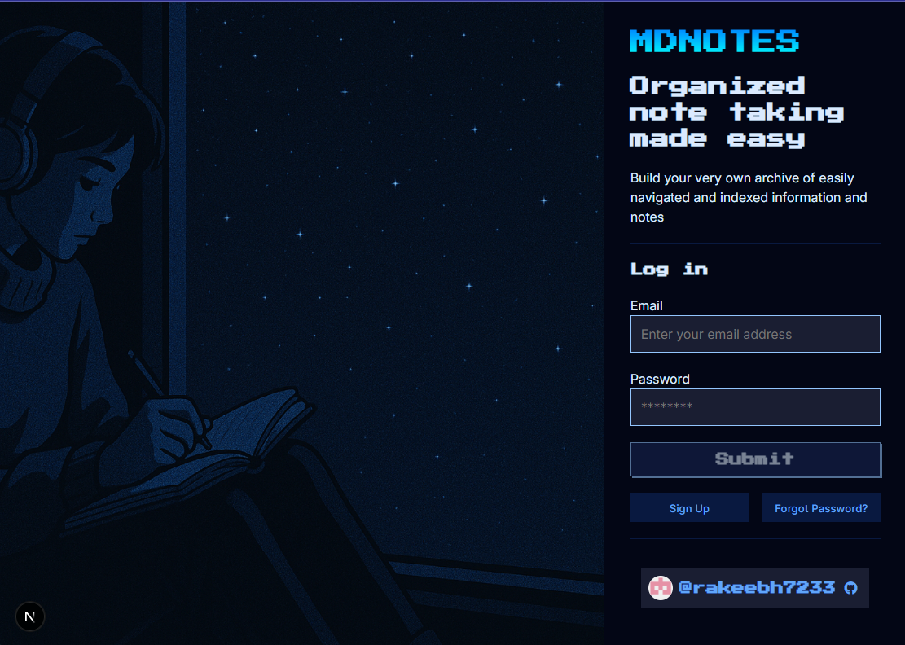
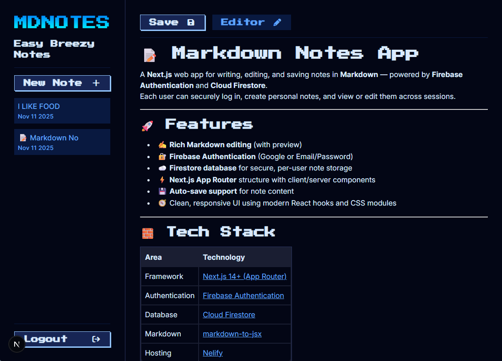

# 📝 Markdown Notes App

A **Next.js** web app for writing, editing, and saving notes in **Markdown** — powered by **Firebase Authentication** and **Cloud Firestore**.  
Each user can securely log in, create personal notes, and view or edit them across sessions.

---

## 🔗 Demo
[🔗 Netlify Demo Link](www.google.com)
<br />



---

## 🚀 Features

- ✍️ **Rich Markdown editing** (with preview)
- 🔐 **Firebase Authentication** (Google or Email/Password)
- ☁️ **Firestore database** for secure, per-user note storage
- ⚡ **Next.js App Router** structure with client/server components
- 💾 **Auto-save support** for note content
- 🕰️**Password Reset** functionality through email
- 🧭 Clean, responsive UI for all screen sizes (mobile supported)

---
 
## 🧱 Tech Stack

| Area | Technology |
|------|-------------|
| Framework | [Next.js 14+ (App Router)](https://nextjs.org/) |
| Authentication | [Firebase Authentication](https://firebase.google.com/docs/auth) |
| Database | [Cloud Firestore](https://firebase.google.com/docs/firestore) |
| Markdown | [markdown-to-jsx](https://www.npmjs.com/package/markdown-to-jsx) |
| Hosting  | [Nelify](https://www.netlify.com/)|

---

## ⚙️ Getting Started

### 1. Clone the repository

```bash
git clone https://github.com/yourusername/markdown-notes.git
cd markdown-notes
```

### 2. Install dependencies
```bash
npm install
```

### 3. Setup Firebase
Create a Firebase project in the Firebase Console.
Enable the following services:
- Authentication → Sign-in method (Email/Password or Google)
- Cloud Firestore → Create a database in production/test mode

Copy your Firebase config from the console and create a new `.env` file in the root:
```bash
NEXT_PUBLIC_FIREBASE_API_KEY=YOUR_API_KEY
NEXT_PUBLIC_FIREBASE_AUTH_DOMAIN=YOUR_AUTH_DOMAIN
NEXT_PUBLIC_FIREBASE_PROJECT_ID=YOUR_PROJECT_ID
NEXT_PUBLIC_FIREBASE_STORAGE_BUCKET=YOUR_STORAGE_BUCKET
NEXT_PUBLIC_FIREBASE_MESSAGING_SENDER_ID=YOUR_SENDER_ID
NEXT_PUBLIC_FIREBASE_APP_ID=YOUR_APP_ID
```
Firestore Database Security Rules
```bash
rules_version = '2';
service cloud.firestore {
  match /databases/{database}/documents {
    
    // Allow users to access their own document
    match /users/{userId} {
      
      allow read, write: if request.auth != null && request.auth.uid == userId;
      
      // Notes subcollection
      match /notes/{noteId} {
        allow read, write: if request.auth != null && request.auth.uid == userId;
      }
    }
  }
}
```

### 4. Run the development server
```bash
npm run dev
```
Visit http://localhost:3000 to open the app.

---

## 🗂️ Project Structure
```bash
src/
├─ app/
│  ├─ notes/
│  │  ├─ layout.jsx       
│  │  └─ page.jsx         # Notes Page
│  ├─ head.js
│  ├─ layout.js           # Root layout
│  └─ page.jsx            # Homepage (login)
│
├─ components/
│  ├─ Editor.jsx          # Markdown editor component
│  ├─ Login.jsx           # Login/Register component
│  ├─ Preview.jsx         # Markdown preview component
│  ├─ SideNav.jsx         # Sidebar list of user notes
│  ├─ TopNav.jsx          # Save/Preview/Edit Note
│
├─ context/
│  └─ AuthContext.jsx     # Context provider for user auth state
│
├─ public/hero-img.jpeg   # Home background img
└─ styles/
   ├─ fanta.css           # Premade styles
   └─ globals.css

```

## Credits
Inspired by https://github.com/jamezmca 